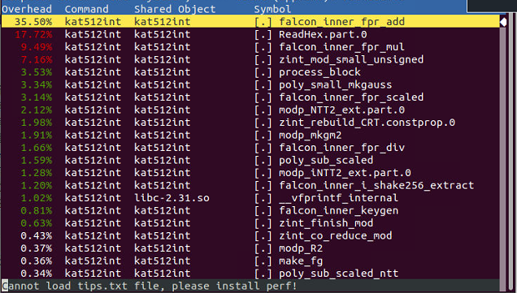
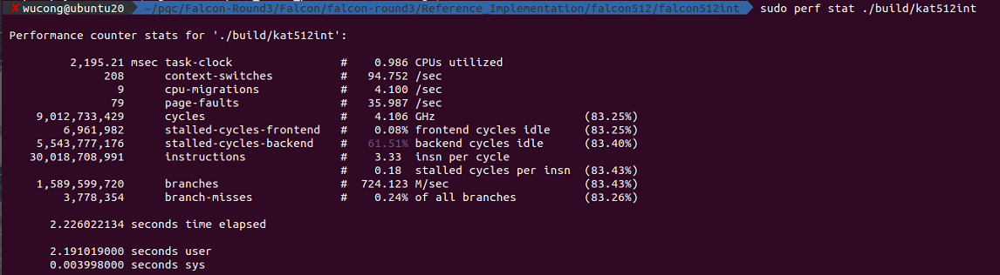
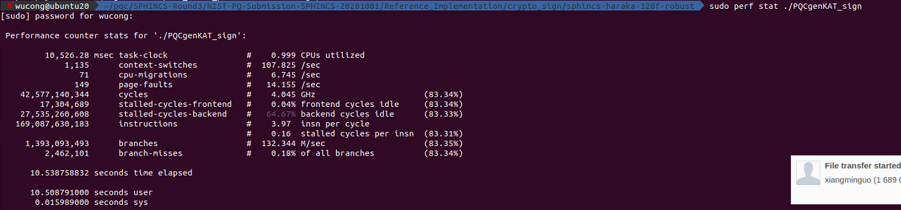
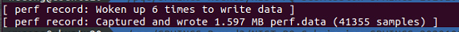
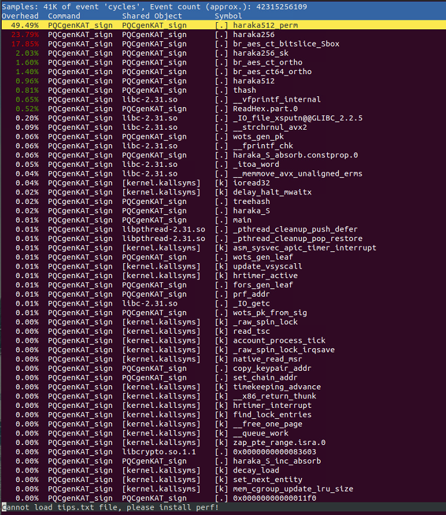
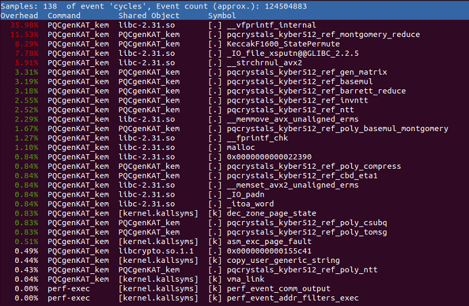
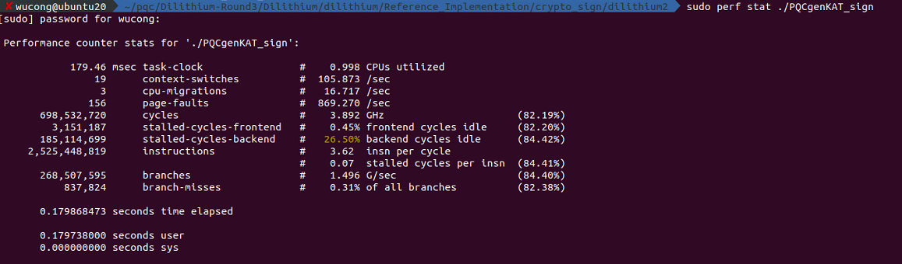
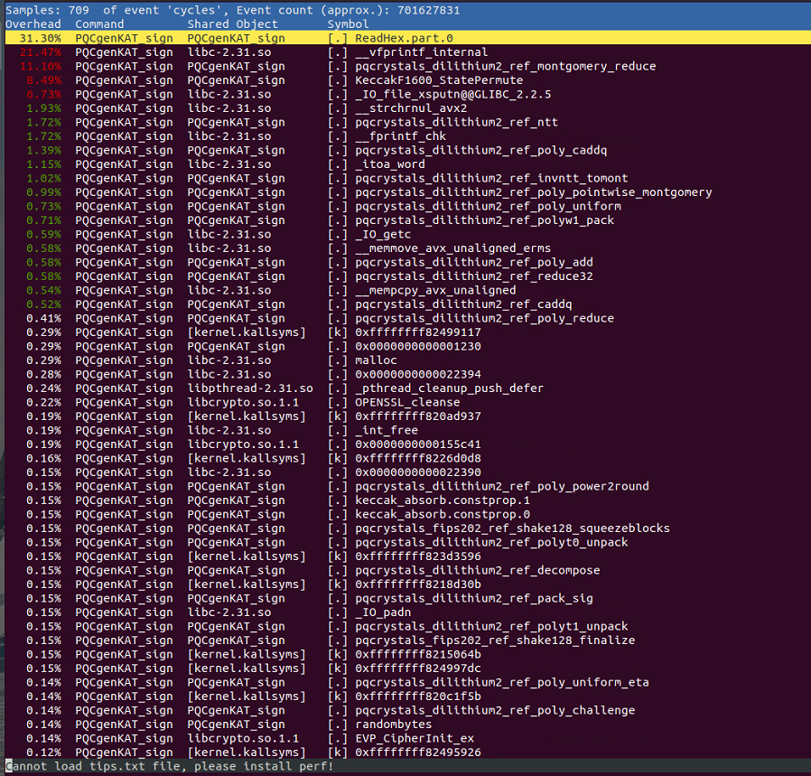

<h1 align = 'center'>3.15&3.22讨论</h1>

## Falcon(falcon512-falcon512int)(keypair sign verify)

## SPHINCS+（haraka-128f-robust）

## Kyber（keypair encode decode）

## Dilithium

## 计划：

目前对各种算法的了解还处于一个宏观的层面，对具体的数据流不是很清楚，因此想要朝着这些方向开展工作：

1. 想要按照清华第一篇论文的思路把**具体的Module**硬件了解一下，并找到算法层面的描述：

   - NTT/INTT(原始输入的数据排布，twiddle factors怎么算，什么时候需要约简怎么和Barret/Mongomery约简结合)

   - 多项式取逆POI

   - 高斯消除GAE和MAO

   - 排序SOT

   - POM（不通过NTT的多项式乘？）

   - 多项式移位POS

   - 压缩和解压CDP

   - （包括第二篇文章的BM算法GF2matOP等）

2. 按第二篇文章的思路：

   - **HASH函数的硬件**除了Keccak SHA3(SHAKE128 256) SH2还有AES和chacha-20

   - **采样的硬件**：双峰拒绝和高斯以及是否还有其他的

3. 每个**算法的数据流**是否有必要像这样梳理一下：

