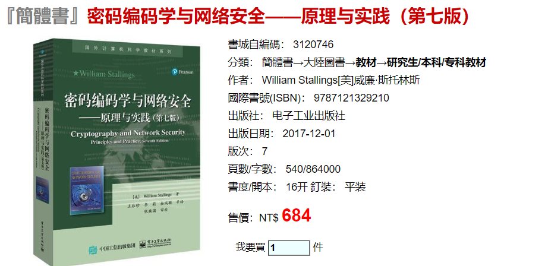
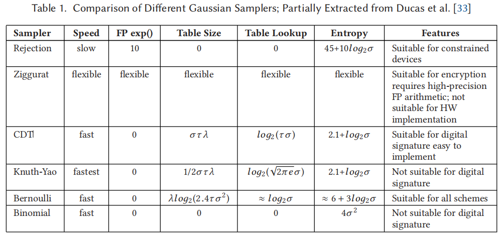
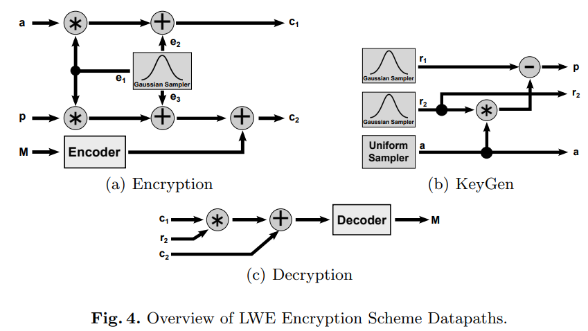
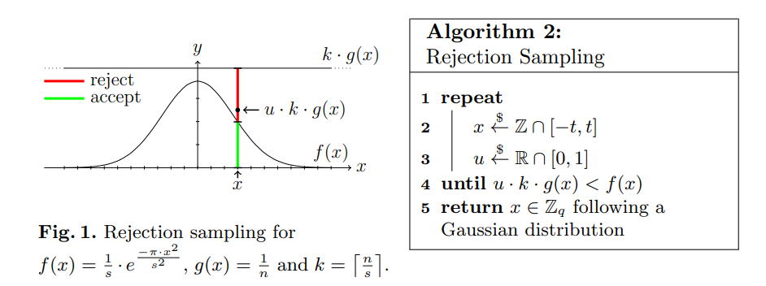
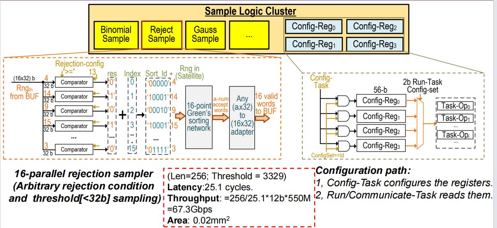
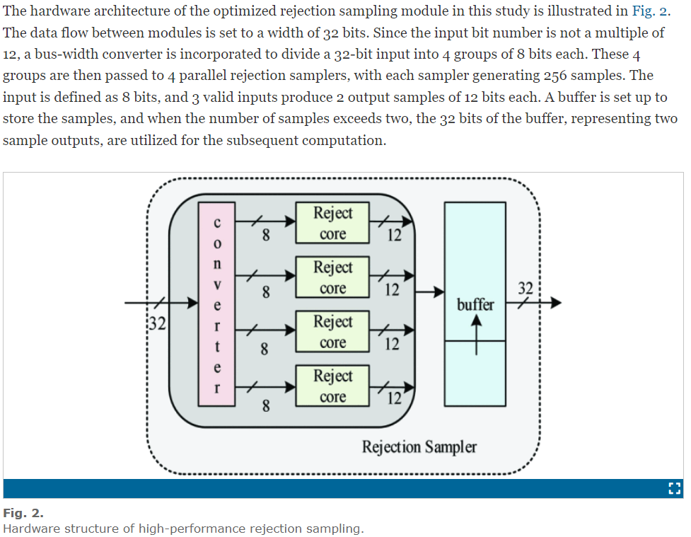
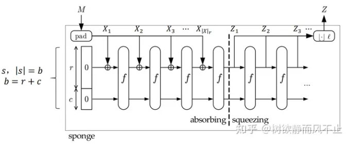
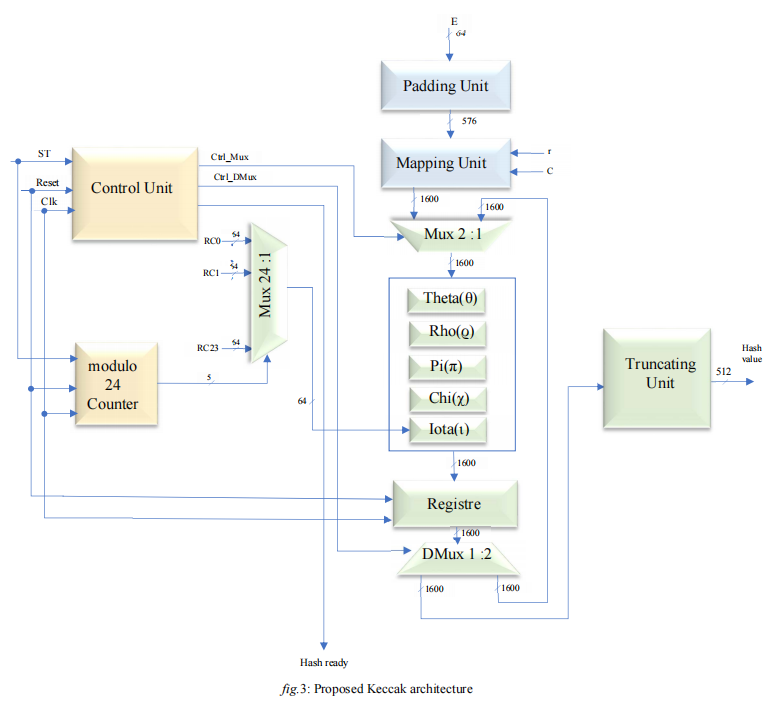
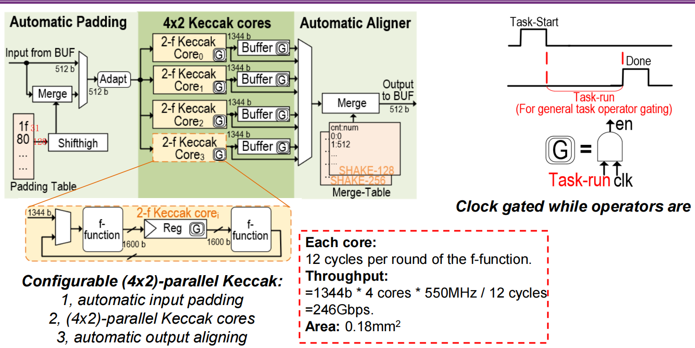
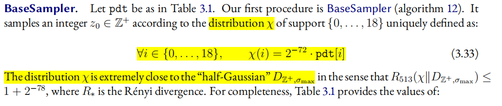

<h1 align = 'center'> 3.8讨论 </h1>

## 基本密码学概念

### 后量子密码分类

- 不同数学问题
  - lattice（**L**attice**B**ased**C**ryptography）
  - code 
  - multi-variable 
  - hash SecurityHAhash  XOF(输出长度可变) 抗碰撞性 随机数生成器PRNG
  - isogeny(broken)

- 攻击算法

  - Shor's algorithm

  - Grover's algorithm

### 不同的应用场景

- kem （key encapsution)
- ds 
- key exchange

### 基于格的算法的几种数学问题

- LWE learn with error e 
- Ring-LWE $Z_q^n$
- Modulo-LWE k
- LWR ounding

### 算法的语义安全

- CCiphertextAttack 
- CPlaintextAttack
- EUF-CMA

### 侧信道攻击side-channel attack

时间，电压电流，

### 推荐书籍

## 具体的Module

### Sampler and small logic

The quality of a **discrete Gaussian sampler** is determined by a tuple of three parameters: ***σ*, *λ*, *τ*** . In such a tuple, *σ* is the **standard deviation** (adjusts dispersal of data from the mean), *λ* is the **precision parameter** (controls statistical difference between a perfect and implemented discrete Gaussian sampler), and *τ* is the **distribution tail-cut** (determines amount of the distribution that we would like to ignore).

完美的高斯采样需要计算exp（）函数（查表操作），带来大量的ROM开销；或者大量的浮点数运算，很大的面积开销；还可能面对侧信道攻击（time）。

**Gaussian samples** **are classified into six categories**, and guidelines are provided for choosing the best candidate on different platforms for specific parameter ranges.

但是不知道为什么清华的模块把Gauss sample单独当成一个模块

*seen from "Post-Quantum Lattice-Based Cryptography Implementations: A Survey"*

哪里需要用到Sample？

*seen from "On the Design of Hardware Building Blocks for Modern Lattice-Based Encryption Schemes"*

- **Reject Sampler**

*seen from "High-Performance Rejection Sampling Hardware Circuit Design for Kyber"*

**VecInv**:应该是Vector inversion具体看论文描述

**GF2MatOp**:应该是Galois 2 field的Matrix Operation，但具体包含哪些操作看论文描述

### Hash

以Keccak为例：

M:Message;b(通常为1600)；l输出信息的长度；

*seen from "An optimal hardware implementation of the KECCAK hash function on virtex-5 FPGA"*

Padding Merge部分：如果从BUF出来的数据不是512b需要进行处理/某些Message需要处理一下

Aligner Merge部分：SHAKE-128/256可以输出任意长度的序列；猜测cnt:l的index，num:$Z_l$的值

### Arithmetic

### Communication

### Format

## 不同的算法

| algorithm                                      | 数学问题                  | Sample                                | Hash                                                         |                                                              |
| ---------------------------------------------- | ------------------------- | ------------------------------------- | ------------------------------------------------------------ | ------------------------------------------------------------ |
| kyber（kem）                                   | MLWE                      | Uniform Sample；Binomial Sample       | AES-256；SHA-256，SHA-512；SHA3-256，SHA3-512，SHAKE-128，SHAKE-256； |                                                              |
| dilithium（sign）(Fiat-Shamir)                 | MLWE                      | 通过Reject sample来实现Uniform Sample | SHAKE-256；SHAKE-128，AES256                                 |                                                              |
| falcon（sign) (hash-and-sign + NTRU lattices） | MLWE                      | 高斯采样                              | SHAKE-256                                                    | GPV framework+NTRU lattice;NTRU equation；快速傅里叶采样算法需要浮点数运算 |
| SPHINCS+（sign）                               | Hash                      | 只需要产生随机数                      | SHAKE-256；SHA-256；Haraka                                   | 基于哈希函数值建立起一棵树（森林），某些根节点和叶子节点被用来当作公钥和密钥 |
| AIGIS                                          | MLWE与kyber dilithiun类似 |                                       |                                                              |                                                              |
| LAC                                            | RLWE                      |                                       |                                                              |                                                              |
| RSA/ECC                                        |                           |                                       |                                                              |                                                              |
| SM2                                            | 与ECC类似基于椭圆曲线     |                                       |                                                              |                                                              |

